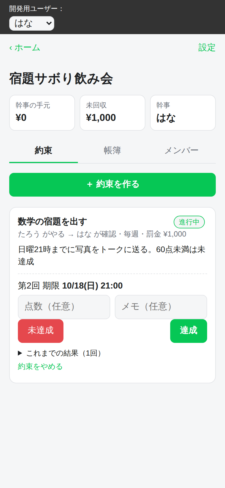
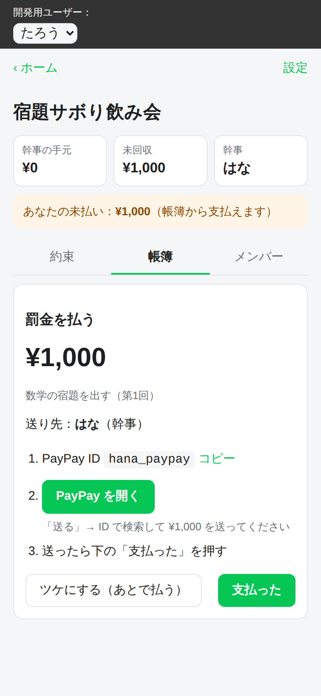
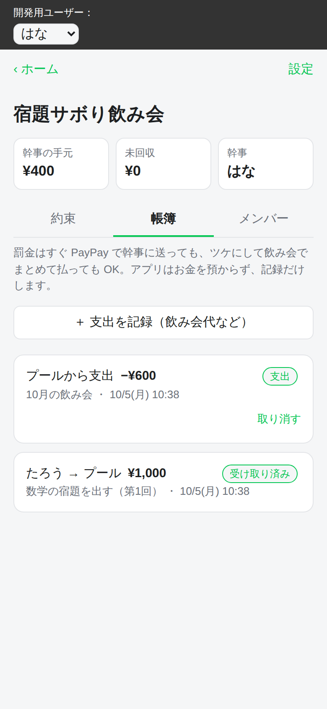

# やくそく

友達同士で「約束を守れなかったら罰金をプールに入れる」という取り決めをして、帳簿をつけ、PayPay での支払いまで案内する LINE ミニアプリです。
例：「数学の宿題を毎週出す。出さなかったり赤点だったりしたら 1,000 円を飲み会プールへ」

**アプリはお金を預かりません。** 誰がいくら払うべきか、払ったかを記録するだけです。実際の送金は、ユーザーが PayPay で幹事に送るか、飲み会のときに現金で払います。この方針にした理由は [docs/feasibility.md](docs/feasibility.md) にまとめています。

| 約束と判定 | 罰金の支払い | 帳簿（幹事） |
|---|---|---|
|  |  |  |

## できること

- **プール**：飲み会用の積立先です。作った人が幹事になり、LINE で招待リンクを送って友達を呼べます
- **約束**：「やる人」「確認する人」「罰金」「毎週か 1 回きりか」「期限」を決めます。相手が同意すると始まります
- **判定**：確認する人が「達成」か「未達成」を付けます（点数とメモは任意）。未達成なら罰金が帳簿に載ります。毎週の約束なら翌週の回が自動でできます。結果は LINE のトークで知らせられます
  - 提出物（宿題の写真など）は LINE のトークで送ってもらいます。アプリには保存しません
- **支払いの導線**：幹事の PayPay ID をコピーして PayPay を開き、送金後に「支払った」を押します。幹事が「受け取った」を押すと完了です。「ツケにする」を選べば、飲み会でまとめて払えます
- **帳簿**：幹事の手元にあるはずの額と未回収の額を表示します。飲み会などでプールから使ったお金も記録できます。罰金は確認する人か幹事が取り消せます（揉めたとき用）

## 構成

- 画面：React と Vite、[LIFF SDK](https://developers.line.biz/ja/docs/liff/)（`src/client`）
- API：Cloudflare Workers 上の Hono（`src/worker`）。データベースは Cloudflare D1（SQLite、スキーマは `migrations/`）
- 共通の型、帳簿の集計、入力チェック：`src/shared`
- 認証：LIFF の ID トークンを、サーバー側で LINE の検証 API に送って確認します

## ローカルで動かす（LINE なし）

```sh
npm install
cp .dev.vars.example .dev.vars        # サーバー側：開発用ログインを有効にする
echo "VITE_DEV_AUTH=1" > .env.local   # 画面側：LIFF を使わない開発モード
npm run db:migrate:local
npm run dev                           # http://localhost:5173
```

画面上部の「開発用ユーザー」で、たろう・はな・けんを切り替えながら操作できます。複数人のやり取りを 1 台で試すときは、ブラウザのウィンドウを分けてください。

```sh
npm test           # 帳簿の集計と API のテスト（ローカルの D1 を使う）
npm run typecheck
```

## LINE ミニアプリとして公開する

1. **Cloudflare**
   - `npx wrangler d1 create yakusoku` を実行し、表示された `database_id` を `wrangler.jsonc` に書く
   - `npm run db:migrate:remote` を実行する
2. **LINE Developers**
   - プロバイダーを作り、**LINE ミニアプリ**のチャネルを作る
   - チャネル内の LIFF 設定でエンドポイント URL に Workers の URL を入れ、スコープは `openid` と `profile` にする
   - 「シェアターゲットピッカー」を有効にする（招待や結果を LINE で送るのに使う）
3. **設定値**
   - `wrangler.jsonc` の `LINE_CHANNEL_ID` に、そのチャネルのチャネル ID を入れる
   - ビルド時の環境変数 `VITE_LIFF_ID` に LIFF ID を入れる（`.env.local` などに書く）
   - `VITE_DEV_AUTH` と `DEV_AUTH` は本番では設定しない
4. `npm run deploy`

審査前（未認証）のミニアプリでも、URL を知っている友達同士なら使えます。認証済みミニアプリの審査を受けるのは、検索に出したい場合などです。最新の条件は LINE の公式ドキュメントで確認してください。

## 未確認・今後

- **PayPay を開くボタン**：`paypay://` で PayPay アプリが開くか、送金画面まで開けるかは、iPhone・Android の LINE 内で実機確認が必要です。開けない場合は、ID のコピーと手動での案内だけにします
- **期限のリマインド**：今は通知がありません。LINE 公式アカウントからのプッシュ通知か、ミニアプリのサービスメッセージで送る方向で検討します
- **飲み会の割り勘**：プール残高を差し引いた割り勘計算と、精算額の提示
- **異議申し立て**：判定に第三者（グループのメンバー）が入る仕組み
- **未成年向けモード**：お金を使わない罰ゲームやポイントにする
